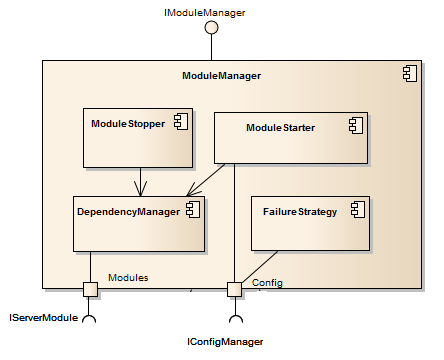
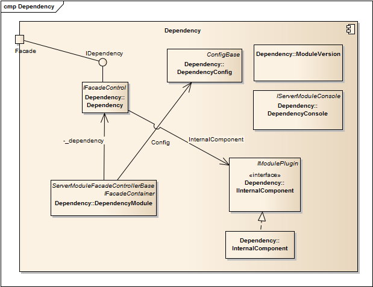

# Component Composition

Component composition within the Runtime is designed as a two-level hierarchical tree.

Level 1 or the global level is composed by a modified instance of the **Moryx.Container** DI-container. It is modified to only fetch components decorated with the GlobalComponentAttribute or any of its derived types. This containers life cycle is coupled to the applications life cycle meaning it is created once the application is started and  is only destroyed when the application is closed. On level 1 we place all components that make up the functional structure of the application. It should somehow reflect the different parts and features of the product. The fact that level 1 is loaded statically based on the deployment and can not be configured shall underline the structure focus of level 1.

On level 2 many instances of local containers create and manage component compositions for the life time of their host component. These containers are mostly **Moryx.Container** instances modified to only load classes decorated with the _PluginAttribute_ or _PluginFactoryAttribute_. In most cases the host component is a ServerModule. Other examples for level 1 components with level 2 containers are the data models. While level 1 defines the structure of the product, the behavior definition is done on level 2. This is where plugins, configs and strategies come into play.  

## Level 1

The level 1 composition is a static one - meaning it is composed only once and all object references remain valid for the entire application life cycle. Therefor **object instances from level 2 MUST not be registered** in the global container.


In the table below all component-types of the global container are listed.

|ComponentType|Attribute|Provided|Required|
|-------------|---------|--------|--------|
| ConfigManager | KernelComponent | IConfigManager <br> IRuntimeConfigManager | |
| Runmode | Runmode | IRunMode | IModuleManager <br> (IRuntimeConfigManager) <br> (ILoggerManagement) |
| Logging | KernelComponent | ILoggerManagement <br> IServerLoggerManagement | IConfigManager |
| ModelResolver | KernelComponent | IModelResolver | UnitOfWorkFactory[] |
| ModuleManager | InitializableKernelComponent | IModuleManager | IConfigManager <br> ILoggerManagement <br> IServerModule[] |
| HostFactory | InitializableKernelComponent | IWcfHostFactory | IConfigManager <br> ILoggerManagement |
| ClientFactory |  InitializableKernelComponent | IWcfClientFactory | IConfigManager <br> ILoggerManagement |
| ServerModule | ServerModule | IServerModule | IConfigManager <br> ILoggerManagement <br> (IWcfHostFactory) <br> ... |
| UnitOfWorkFactory | ModelFactory | IUnitOfWorkFactory | IConfigManager |


The level 1 component structure is shown in the following component diagram. In this diagram some components from the table above are missing. Because the host and client factory are very similar in their architecture the client factory was not modeled explicitly. Having a close look at the diagram one can see, that the level 1 structure is completely cycle free. The fact that almost every component uses the ConfigManager also demonstrates the general idea of flexibility throughout the framework.


## Level 2

In theory everything within a level 1 component is considered a level 2 component structure. Therefor this section could contain anything from 1 to n different architectures. Because writing documentation is annoying enough I have just written it for the most important components this section was grouped into different categories.

### Kernel component architecture

Naturally every kernel component has its own architecture otherwise they would be somewhat redundant. However most of them share a similar structure and pattern that will be described briefly.

Most kernel components do not use DI or plugin mechanisms. The classes they are build of are composed in a static fashion and only exist to split up the components responsibilities. This makes each of the parts easier to understand and maintain. A good example for this is the internal structure of the ModuleManager.



### Datamodel architecture

Because the data models are all generated by the same code generator they share the same architecture. Framework access to the datamodel is provided by the ModelConfigurator while modules can access the database within an open UnitOfWork provided by the UnitOfWorkFactory. Access to the individual tables is provided by the IRepository interfaces that can be fetched from the UnitOfWork. IRepository resolution is done by a type-delegate generated by the T4-templates.

A generated map might look like this:

````cs
private static readonly Dictionary<Type, RepoBuilder> RepoBuilders = new Dictionary<Type, RepoBuilder>
{
    { typeof(ILibraryRepository), LibraryRepository.Create },
    { typeof(IRepository<Library>), LibraryRepository.Create },
    { typeof(IUserGroupRepository), UserGroupRepository.Create },
    { typeof(IRepository<UserGroup>), UserGroupRepository.Create },
    { typeof(IApplicationRepository), ApplicationRepository.Create },
    // ...
};
````

### ServerModule architecture <a id="runtime-ServerModuleArchitecture" />

Like kernel components each server module has its own architecture. But they all share a common structure. Core of every server modules infrastructure is the ModuleController-folder within the project. This folder should be found in every project and it should contain 3 files.

* **ModuleController:** Central infrastructure component. The module controller can be considered as the link between level 1 and 2. It is part of the global container and has access to all components in it. It is also the host of the local container and therefor has access to all local components as well. It is its responsibility to register required components from the global container in the local container and to trigger object tree creation by resolving and starting the root of the composition. It is also part of the facade linking process by exporting provided facades via the IFacade interface and importing required facades via the _RequiredModuleApiAttribute_.

* **ModuleConfig:** Root object of the typed config class tree. It mostly contains directory names used for plugins, plugin-configs and module strategies. An instance of the config class is fetched by the _ModuleController_ during the initialize transition and is available in the _Config_-property of the _ModuleController_ or via dependency injection.

* **ModuleConsole:** The module console provides a command line interface to interact with the server module without any custom client. It can be used for initial testing, debugging or 'admin access'-features. It has access to all components of the local container. For further information on the console please refer to the **ModuleConsole Guide**.

If your module provides an API to other modules your project will also have a facade folder with 2 files:

* **FacadeInterface:** This interface with a name like _IFacade.cs_ is (one of) your modules public API(s). Its method should hide the internal component structure and **MUST never return instances from the local container**. Apart from this restriction facades can use the whole feature set of the .NET including events, generics, ...

* **FacadeClass:** This class implements the _FacadeInterface_ and the _IFacadeControl_ interface. It has access to a _ValidateHealthState_-delegate and to the local container via dependency injection (Not Castle, but a small self-implemented version). For further details please refer to the **Facade Guide**.

So far we only covered infrastructure classes. In order for modules to implement business logic offer new features to the user we need another type of classes - components and plugins. For this classes, interfaces and enums folders are usually named implementation, components or have a functional component name like 'Scheduling'. Files in those directories are:

* **Components:**  Components are static parts of your modules object tree. They make up the modules core and their behavior is only influenced by the config. Usually each component is defined as a pair of one interface and one class. There may also be more than one implementation of the class, giving it a plugin like behavior. In this case switching implementations is considered configuring the component.

* **Plugins:** Plugins are the Runtime way of flexibility and customization. Plugin structures are created by defining a plugin interface with operations that can not be wired into the core but depend on the deployment and final application. Plugin implementations are later build as separate DLLs and placed in a certain folder. The module will load the implementations and include them in the object tree. This can be done by always using the first instance or using the config. For details on the topic please read the **Plugin Guide**.


