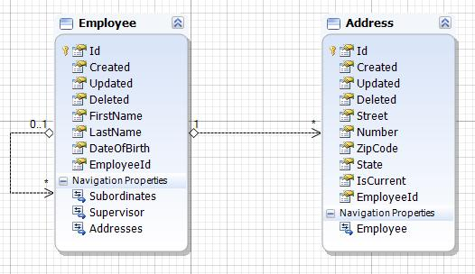

# Model Setups

For our tutorials we will use a rather simple reference model that contains a couple of entities and relations between them. This tutorial does not include model merge of any kind. I assume that if you understood model merge and model setups you will be capable of doing this yourself.

**Our sample model**
As a sample model we will use a small datamodel that could be used to manage a companies staff. It will have employee, address and relation data. Do not use it as a design reference as it is neither optimized nor normalized. It serves the plain purpose of demonstrating how to insert data into the database with a setup. The schematic model is shown below:



## Hard coded setup

As a first example we will start by creating some key employees hard coded. It will create the boss as well as his assistant and an in-turn. To create a model setup create a new class within you model assembly or create new ClassAssembly project with all necessary references. Add the `ModelSetupAttribute` to the class and inherit it from [IModelSetup](xref:Marvin.Model.IModelSetup).

````cs
[ModelSetup(TargetModelNamespace = StaffConstants.Namespace)]
public class HardCodedSetup : IModelSetup
{
    public int SortOrder => 1;
    public string Name => "Sample";
    public string Description => "Sample Description";
    public string SupportedFileRegex => string.Empty;
    [...]
}
````

### Hard coded infrastructure

First we have to take care of the attribute and read only properties required by the Runtime. They are necessary for the framework to find, match and map the setups correctly:

| Property | Description |
|----------|-------------|
| SortOrder | In many cases you will have more than one setup for a model. If any of these setups depend on each other and must be executed in a certain order please assign the sort order accordingly. Otherwise just return 1. |
| Name | Short and hopefully unique name of this setup. |
| Description | Short description to indicate what this setup will do and wich data is created. |
| SupportedFileRegex | The regex for files we can import. Since this setup is hard coded leave it empty. |

You should end up with something like this:

````cs
[ModelSetup(TargetModelNamespace = StaffConstants.Namespace)]
public class HardCodedSetup : IModelSetup
{
    public int SortOrder => 1;
    public string Name => "Hardcoded setup";
    public string Description => "This setup will create Thomas and Dennis";
    public string SupportedFileRegex => string.Empty;
    [...]
}
````

### Repositories

If you are familiar with the database API you may skip this section. Even though projects build on the Platform use the EntityFramework as ORM it is wrapped in interfaces. The `IUnitOfWork` wraps the `DbContext` and transaction while `IRepository` implementations wrap the `DbSets` and provide most of the common database access and modification methods. It is usually good design to move all repository declarations to the top of the method. That way you do not mix operations with boiler plate and colleagues can spot all accessed tables easily. In our example we will use both repositories - those for Employee and Address. Further reading [UnitOfWork Pattern](xref:Model.UnitOfWorkPattern).

### Hard coded entity creation

In our setup we will create a supervisor and two subordinates together with their address (which is obviously fictional). For entity creation we will use the generated Create-overload that accepts all non-nullable properties. This way we make sure to not forget any mandatory properties.

````cs
public void Execute(IUnitOfWork openContext, string setupData)
{
    var employeeRepo = openContext.GetRepository<IEmployeeRepository>();
    var addressRepo = openContext.GetRepository<IAddressRepository>();

    // Create the one and only boss
    var andreas = employeeRepo.Create("Kathrin", "Cole", new DateTime(1980, 7, 10));
    andreas.Addresses.Add(addressRepo.Create("Bossway", 1, 12345, "NRW"));

    var thomas = employeeRepo.Create("Claudia", "Bach", new DateTime(1991, 4, 21));
    thomas.Addresses.Add(addressRepo.Create("Highway to perfection", 42, 42007, "NRW"));
    thomas.Supervisor = andreas;

    var dennis = employeeRepo.Create("Lea", "Adler", new DateTime(1992, 02, 21));
    dennis.Addresses.Add(addressRepo.Create("Pretty drive", 7, 32816, "NRW");
    dennis.Supervisor = andreas;

    openContext.Save();
}
````

## File based setup

In many cases we have to import from other system through some export formats or we create our own import file standard. In any case we have to read a files content and insert its information into the database. For our example we will use a very simple file format that does not require any complex file parsing. If you have to parse CSV or Excel files, please refer to the CsvHelper or EPPlus documentation.

### File based infrastructure

The infrastructure properties of file based setups are the same except for the `SupportedFileRegex`. Here we must define a naming scheme to map files to this setup. In our example we will use `EmployeeCard_\w+\.txt` to match files like `EmployeeCard_Claudia.txt`.

````cs
public string SupportedFileRegex => @"EmployeeCard_\w+\.txt";
````

### File based entity creation

For our setup we will assume that each line contains one or more properties always in the same format. The following file format should be imported:

````text
Claudia Bach
21.04.1991
Highway to perfection:42
12345 NRW
Kathrin Cole
````

A setup parsing the file and creating the entity might look likes this:

````cs
public void Execute(IUnitOfWork openContext, string setupData)
{
    var employeeRepo = openContext.GetRepository<IEmployeeRepository>();
    var addressRepo = openContext.GetRepository<IAddressRepository>();

    var index = 0;
    var lines = File.ReadAllLines(setupData);

    // Line 1: Full name, Line 2: Birthday
    var name = lines[index++].Split(' ');
    var birthDay = DateTime.Parse(lines[index++]);

    // Line 3: Street and number
    var streetAndNumber = lines[index++].Split(':');
    var street = streetAndNumber[0];
    var number = int.Parse(streetAndNumber[1]);

    // Line 4: Zip code and state
    var zipAndState = lines[index++].Split(' ');
    var zip = int.Parse(zipAndState[0]);
    var state = zipAndState[1];

    // Line 5: Optional supervisor
    var supervisor = new[] { string.Empty, string.Empty };
    if (index < lines.Length)
        supervisor = lines[index].Split(' ');

    // Create entity
    var employee = employeeRepo.Create(name[0], name[1], birthDay);
    employee.Addresses.Add(addressRepo.Create(street, number, zip, state));
    employee.Supervisor = employeeRepo.GetMatch(supervisor[0], supervisor[1]);

    openContext.Save();
}
````